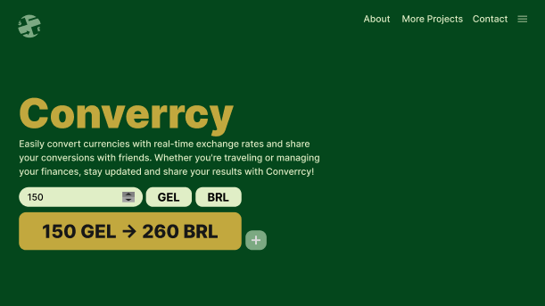

# Converrcy

Converrcy é um projeto em React para um conversor de moedas online, desenvolvido para praticar TypeScript, React, uso de APIs e UI Design.

## Status do Projeto

🚧 **Projeto em desenvolvimento** 🚧

## Tecnologias Utilizadas

- **React**: Biblioteca JavaScript para construção de interfaces de usuário.
- **TypeScript**: Superset de JavaScript que adiciona tipagem estática ao código.
- **Styled Components**: Biblioteca para estilização dos componentes utilizando CSS-in-JS.
- **Figma**: Ferramenta usada para o design da interface do usuário.
- **Visual Studio Code**: Editor de código utilizado no desenvolvimento do projeto.

## Design Proposto

Aqui está uma visão do design UI inicial proposto no Figma:

 

## Futuras Implementações

Estou continuamente trabalhando para melhorar o Converrcy. Futuras atualizações incluirão novas funcionalidades, melhorias na interface do usuário e mais, sempre adicionando as novidades e atualizações aqui.

---

Agradeço pela leitura. Caso tenha alguma sugestão ou queira contribuir, sinta-se à vontade para me avisar pelo meu e-mail rodrigvues@gmail.com .
